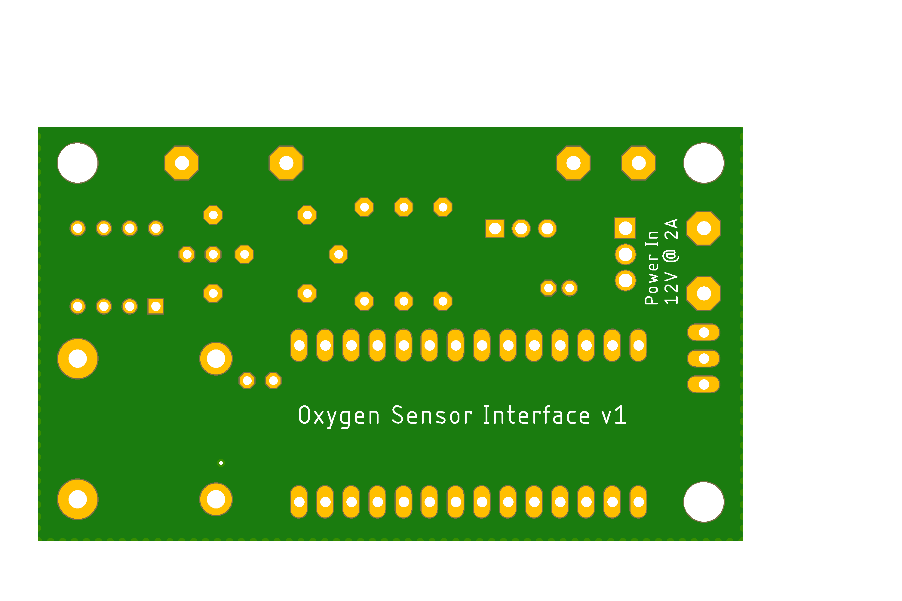

# o2-sensor-interface
An unconventional use of an [automotive oxygen sensor](https://www.oreillyauto.com/detail/b/bosch-3073/engine-sensors---emissions-25132/emission-smog-parts-16465/oxygen-air-fuel-ratio-sensor-12041/24932ed2a03f/bosch-oxygen-sensor/15510/2575736)

## Assembled Board

## Software Setup
The board will emulate a USB serial com port. You can use the arduino serial monitor (Board -> Port menu). 
- [Arduino IDE 1.8.12](https://www.arduino.cc/en/main/software)

You can also use putty if on windows machine.
- [Putty](https://www.chiark.greenend.org.uk/~sgtatham/putty/latest.html)

You only need teensyduino to *update* code on the microcontroller. To simply monitor the serial output it is not needed.
- [TeensyDuino installer](https://www.pjrc.com/teensy/td_download.html)

Needed libs from the Arduino library manager
- Adafruit BusIO
- Adafruit MAX38155

## Schematic
Errata: 
- heater pin to mosfet should be 20 instead of 19 (for pwm capability). jumpered on board for now.
- 0.1uF cap across opamp input (grey wire). soldered on bottom of board for now.

## Layout
Dimensions in inches.

### Top Render

### Bottom Render

## Partslist

Thermocouple: [https://www.amazon.com/gp/product/B07QK4ZG1G](https://www.amazon.com/gp/product/B07QK4ZG1G)

[Digikey BOM](pcb/Digikey_Bom_8219274.csv)
